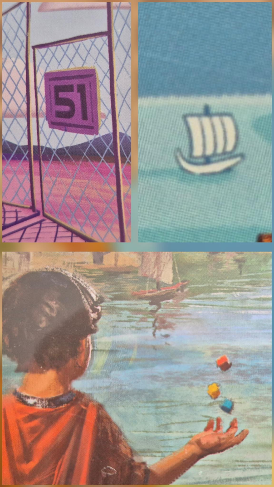
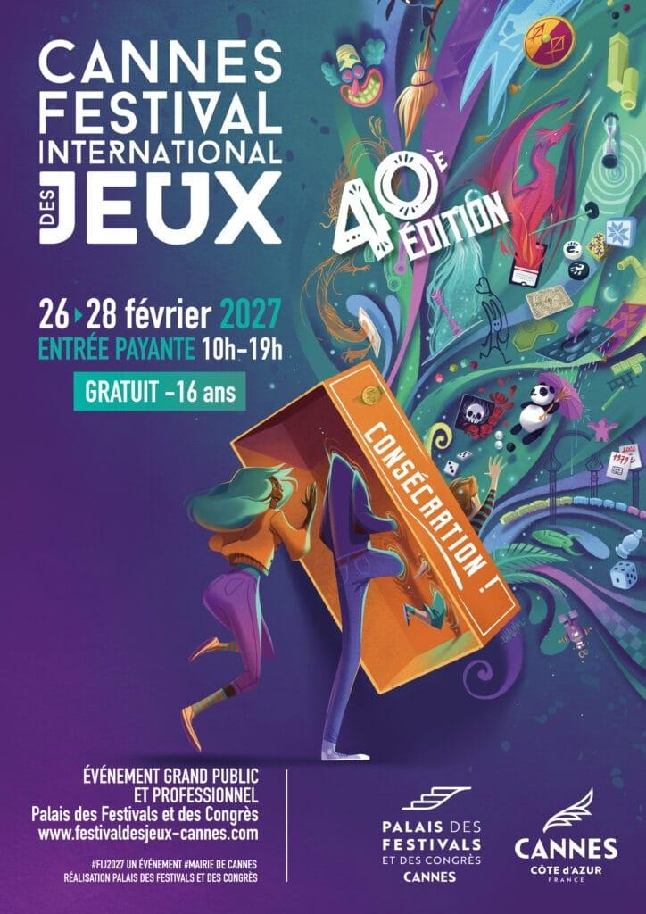

# Newsletter AJG - #01 Septembre 2026

## Édito

Bienvenue à tous dans le premier numéro de cette newsletter que je vais essayer de rédiger tout au long de l'année.    

Je vous propose de faire tous les mois à la fois une veille des dernières sorties et actualités jeux de société, et un suivi de la vie de l'association.  

## Vie locale

07 septembre :  
C'était la rentrée ! Beaucoup d'anciennes têtes, mais aussi de nouvelles personnes, nous ont rejoints.  
Des jeux à nombreux joueurs nous ont permis de briser la glace  entre anciens et nouveaux membres de l'AJG.

11 septembre :  
Jean-Phi nous a proposé une énigme pour révéler les nouveautés du début de l'année !    
   

Les jeux sont Discordia, 7 Wonders Dice et 1er Contact.

14 septembre :  
Certains des nouveaux jeux ont pu être testés, notamment 1er Contact avec Jérôme, Marjo, Amandine et moi-même.

21 septembre :  
Absent, mais Discordia, l'un des nouveaux jeux, a pu être dépunché et découvert.

28 septembre :  
Nouvelle table pour Discordia et 1er Contact. Il y avait aussi une table d'Artemis Project. Courtisans et Rumblebots, deux nouveaux jeux ont pu être également testés.

### Bourse aux jeux

Samedi 10 octobre :  
Bourse aux jeux aux Contrées des Jeux à partir de 9h. Le dépôt se fait à partir du lundi d'avant (le 5). Pensez à y aller tôt si vous voulez les meilleures opportunités.   
Si vous vendez vos jeux, vous aurez le droit à un bon d'achat dans le magasin.   

## Festivals et autres
### Cannes
Après un vote du public, l'affiche du festival de Cannes a été choisie ! C'est l'affiche de [Maud Chalmel](https://www.myludo.fr/#!/people/maud-chalmel-721) qui a été retenue parmi les 9 propositions.

### Vichy

Les 19 et 20 septembre, il y a eu le festival des jeux de Vichy.  
Ce festival est important car c'est le plus gros salon des professionnels du milieu après le FIJ. Comme il a lieu à peu près à mi-route entre deux Cannes, cela permet de voir les prochaines sorties françaises qui vont arriver soit en fin d'année (notamment en octobre/novembre lié d'Essen), soit à Cannes ou l'année prochaine.

Les groupements des boutiques ludiques ont remis des prix :
* Prix éditorial :
[Kodama - Le Petit Théâtre](https://www.myludo.fr/#!/game/le-petit-theatre-95296)
* Prix de l'illustration :
[Charlotte Lacroix - Osmosis](https://www.myludo.fr/#!/game/osmosis-84719)
* Prix du travail auctorial :
[Alexandre Poyé - Limite](https://www.myludo.fr/#!/game/limit-86624)

Pas mal de jeux ont fait parler d'eux. Voici ceux que j'ai retenus :
* [Oddball](https://www.myludo.fr/#!/game/oddball-97750) : jeu de cartes d'affrontement, 2 à 4 joueurs, des millions de personnages uniques.
* [Longue vie au Roi](https://www.myludo.fr/#!/game/longue-vie-au-roi-100690) : on a une main de personnages, avec le roi à peu près au centre. Le but : tuer les rois des autres joueurs. Des sensations à la Oriflamme.
* [Lairs](https://www.myludo.fr/#!/game/lairs-82253) : jeu à 2. On construit un donjon que son adversaire va explorer. Il faut trouver le trésor en esquivant les pièges et les monstres. Jeu évolutif avec des enveloppes contenant de nouveaux pièges et autres.
* [Fragment](https://www.myludo.fr/#!/game/fragments-solara-98551) : jeu d'énigmes sous forme de puzzle. Un Behind sous stéroïdes. Une première petite boîte sort bientôt. Si on accroche, une grosse boîte sortira très prochainement, avec une campagne de 3/4 d'heure.
* [Tidal Blades](https://www.myludo.fr/#!/game/tidal-blades-rise-of-the-unfolders-100639) : Gloomhaven à la plage. Un dungeon crawler qui se passe dans un univers marin. Le système de jeu repose sur une grille de 3x3 qui permet d'activer toutes les cartes d'une colonne ou d'une ligne, à la façon d'un Leda. Une campagne de financement est en cours sur [GameOn](https://www.gameontabletop.com/cf6207/tidal-blades-rise-of-the-unfolders-en-francais.html).

## Sorties intéressantes

Quelques jeux sortis en septembre qui valent le coup d'œil :
* [Hues and Cues](https://www.myludo.fr/#!/game/hues-and-cues-100554) : un jeu d'ambiance où il faut trouver une nuance de couleur.
* [Vin et fromage](https://www.myludo.fr/#!/game/vin-fromage-96472) : un jeu à deux, un peu la suite d'Orge et Blé.
* [Petiquette](https://www.myludo.fr/#!/game/petiquette-99913) : des cartes sont alignées au hasard, et il faut trouver le motif de la carte qui suivrait. Jeu d'ambiance.

## Conclusion

Voilà la fin de cette première newsletter de l'AJG. N'hésitez pas à me faire des retours sur ce que vous souhaitez voir dedans, ce qu'il faut modifier ou pas.
